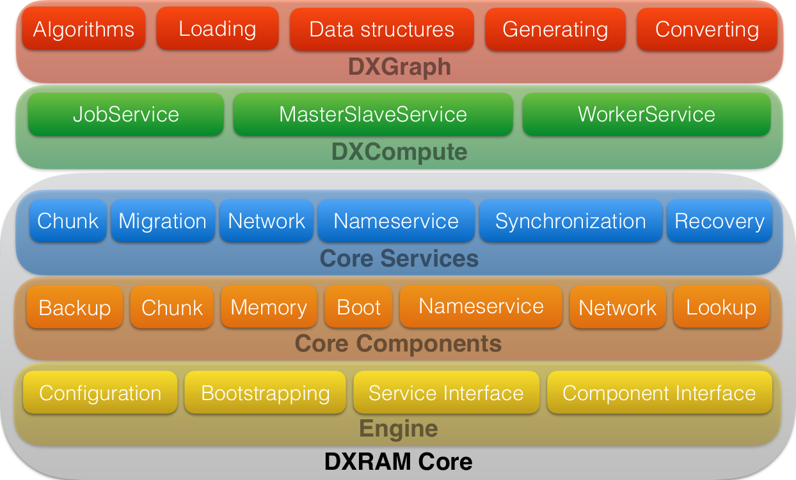

# DXRAM Architecture

DXRAM's core architecture is driven by a minimal foundation called the *DXRAMEngine*. All features that form the DXRAM system are encapsulated in either *components* and *services*.

## DXRAM Engine

The *DXRAMEngine* class provides a minimal foundation to run *components* and *services* which implement the actual functionality for the DXRAM system.
The engine bootstraps using a JSON formatted configuration file. A list of components and services (including their settings) are loaded into an instance of *DXRAMContext*. This allows enabling/disabling of components or services to configure a DXRAM instance according to your requirements. Configuration parameters for components or services are embedded within each class.

After bootstrapping with a configuration file, DXRAM initializes all components using a fixed order which ensures resolving component dependencies correctly. Next, all services are initialized and the boot sequence is terminated by entering the main application loop in the *DXRAM* class.

Applications running on top of the core can be implemented as separate modules and loaded by a DXRAM peer. The applications are running locally on a single DXRAM peer and have access to all available DXRAM services (refer to [this readme](Applications.md)).

## Components

Components are the core building blocks for DXRAM and are based on the abstract class *AbstractDXRAMComponent*. They provide core functionalities like a network interface (*NetworkComponent*), memory management (*MemoryManagerComponent*) or bootstrapping (*ZookeeperBootComponent*). Components can rely on other components as dependencies (e.g. *MemoryManagerComponent* requires *AbstractBootComponent*) and are allowed to access and use each other's features. However, a component is limited to provide functionality to the current DXRAM instance, only, e.g. a component is not allowed to handle communication or network packages with other DXRAM instances. This is done using *services*.

## Services

Services are using components to establish an API for the application programmer to access the back-end as well handle network communication with other DXRAM instances, e.g. access to the key-value store (*ChunkService*) or using the network interface to send your own messages (*NetworkService*). A service can use all components provided by DXRAM. But, services are isolated and not allowed to rely on or use other services. This allows us to enable/disable services we don't need on a DXRAM instance and keeps the API modular and flexible. Furthermore, one can lower the resource requirements of a DXRAM instance by switching off services that are not used.
